# Request Context Framework - Complete Request Flow Architecture

## Overview

The Request Context Framework provides comprehensive context management across the entire request lifecycle with **multi-source extraction**, **four-directional propagation**, and **observability integration**. This document shows the complete flow from client request to response, including all source types and integration points.

## Architecture Components

### Core Components
- **RequestContextFilter** - Early extraction filter (pre-authentication)
- **RequestContextInterceptor** - Post-authentication enrichment and response handling
- **RequestContextService** - Central orchestration service
- **SourceHandlers Registry** - Unified source handler management
- **WebClient Integration** - Downstream propagation and response capture

### Source Types Supported
- **HEADER** - HTTP headers (bidirectional)
- **COOKIE** - HTTP cookies (upstream-only for security)
- **QUERY** - Query parameters (request-only)
- **CLAIM** - JWT claims (extract-only)
- **PATH** - URL path variables (extract-only)
- **BODY** - JSON request/response bodies (with JSONPath)

## Part 1: Complete Upstream Request Processing Flow

This diagram shows the complete flow from client request through all phases of processing.

```mermaid
sequenceDiagram
    participant Client
    participant Filter as RequestContextFilter
    participant Service as RequestContextService
    participant SourceHandlers as SourceHandlers Registry
    participant MultiHandlers as Multiple Source Handlers
    participant Security as Spring Security
    participant Interceptor as RequestContextInterceptor
    participant Controller
    participant Observability as Observability Systems

    Note over Client,Observability: === COMPLETE UPSTREAM REQUEST PROCESSING ===

    Client->>Filter: HTTP Request<br/>(Headers, Cookies, Query, Body)
    activate Filter

    Filter->>Service: initializeContext(request)
    activate Service
    Note right of Service: Pre-authentication phase extraction

    Service->>SourceHandlers: extractPreAuthPhaseFields(request)
    activate SourceHandlers
    Note right of SourceHandlers: Extract from non-auth sources

    SourceHandlers->>MultiHandlers: Extract from multiple sources
    activate MultiHandlers
    Note right of MultiHandlers: • HEADER: X-Request-ID, X-Tenant-ID<br/>• COOKIE: session cookies<br/>• QUERY: version, client_id<br/>• PATH: user/{id}, org/{slug}
    MultiHandlers-->>SourceHandlers: Return extracted values
    deactivate MultiHandlers

    SourceHandlers-->>Service: All pre-auth values extracted
    deactivate SourceHandlers

    Service->>Service: Store in RequestContext
    Service->>Service: Set in ThreadLocal & Request
    Service->>Service: Initialize MDC for logging
    Service-->>Filter: Context initialized
    deactivate Service
    deactivate Filter

    Filter->>Security: Continue filter chain
    activate Security
    Security->>Security: Authenticate user (JWT validation)
    deactivate Security

    Security->>Interceptor: Continue to MVC interceptor
    activate Interceptor
    Note right of Interceptor: Post-authentication enrichment

    Interceptor->>Service: enrichWithPostAuthPhaseData(request)
    activate Service
    Service->>SourceHandlers: Extract auth-dependent sources
    activate SourceHandlers
    Note right of SourceHandlers: • CLAIM: sub, roles, tenant<br/>• Authenticated headers
    SourceHandlers-->>Service: Auth values extracted
    deactivate SourceHandlers
    Service-->>Interceptor: Context enriched
    deactivate Service

    Interceptor->>Service: enrichWithContextData(handlerMethod)
    activate Service
    Note right of Service: Add framework-provided fields
    Service->>Service: Set apiHandler field
    Service->>Service: Update MDC with all fields
    Service-->>Interceptor: Context complete
    deactivate Service

    Interceptor->>Service: validateRequiredFields(context)
    activate Service
    Service->>Service: Check required field constraints
    Service-->>Interceptor: Validation complete
    deactivate Service

    Service->>Observability: Update metrics, logs, traces
    activate Observability
    Note right of Observability: • MDC logging integration<br/>• Micrometer metrics<br/>• Distributed tracing
    deactivate Observability

    Interceptor->>Controller: Execute handler method
    activate Controller
    Note right of Controller: RequestContext fully available<br/>with all source types extracted
    deactivate Controller
```



## Part 2: Downstream Service Integration Flow

This diagram shows the complete downstream integration including request propagation, response capture, and body buffering.

```mermaid
sequenceDiagram
    participant Controller
    participant WebClient
    participant PropFilter as RequestContextWebClientPropagationFilter
    participant CaptureFilter as RequestContextWebClientCaptureFilter
    participant LoggingFilter as RequestContextWebClientLoggingFilter
    participant Enricher as RequestContextEnricher
    participant SourceHandlers as SourceHandlers Registry
    participant MultiHandlers as Multiple Source Handlers
    participant Downstream as Downstream Service
    participant Observability as Observability Systems

    Note over Controller,Observability: === COMPLETE DOWNSTREAM INTEGRATION ===

    Controller->>WebClient: Make downstream call
    activate WebClient
    Note right of Controller: RequestContext available via ThreadLocal

    WebClient->>PropFilter: Process outbound request
    activate PropFilter

    PropFilter->>Enricher: extractForDownstreamPropagation(context)
    activate Enricher
    Note right of Enricher: Get all propagation data
    Enricher->>Enricher: Read downstream.outbound configs
    Enricher->>Enricher: Apply value transformations
    Enricher->>Enricher: Filter by extSysIds if specified
    Enricher-->>PropFilter: Return propagation data map
    deactivate Enricher

    PropFilter->>SourceHandlers: enrichDownstreamRequest(enrichmentType, builder, key, value)
    activate SourceHandlers
    Note right of SourceHandlers: Apply multi-source propagation

    SourceHandlers->>MultiHandlers: Apply enrichments by type
    activate MultiHandlers
    Note right of MultiHandlers: • HEADER: X-User-ID, X-Tenant-ID<br/>• QUERY: version, client_id<br/>• COOKIE: session data (if configured)
    MultiHandlers-->>SourceHandlers: All enrichments applied
    deactivate MultiHandlers

    SourceHandlers-->>PropFilter: Request fully enriched
    deactivate SourceHandlers
    deactivate PropFilter

    WebClient->>LoggingFilter: Log outbound request
    activate LoggingFilter
    LoggingFilter->>Observability: Enrich MDC and log request
    activate Observability
    Note right of Observability: • Structured logging<br/>• Request metrics<br/>• Trace correlation
    deactivate Observability
    deactivate LoggingFilter

    WebClient->>Downstream: HTTP Request with propagated context
    activate Downstream
    Note right of Downstream: Receives:<br/>Headers, Query params, etc.
    Downstream-->>WebClient: HTTP Response (headers + body)
    deactivate Downstream

    WebClient->>CaptureFilter: Process inbound response
    activate CaptureFilter

    CaptureFilter->>CaptureFilter: Check if body extraction needed
    alt Body extraction configured
        CaptureFilter->>CaptureFilter: bufferResponseBody(response)
        Note right of CaptureFilter: Buffer body to prevent consumption issues
    end

    CaptureFilter->>Service: enrichWithDownstreamResponse(response, context)
    activate Service
    Service->>SourceHandlers: Extract from response
    activate SourceHandlers
    Note right of SourceHandlers: Extract from multiple sources

    SourceHandlers->>MultiHandlers: Extract by source type
    activate MultiHandlers
    Note right of MultiHandlers: • HEADER: X-Response-Time, X-Service-Version<br/>• BODY: JSONPath extraction from JSON
    MultiHandlers-->>SourceHandlers: All values extracted
    deactivate MultiHandlers

    SourceHandlers-->>Service: Response data extracted
    deactivate SourceHandlers
    Service->>Service: Update RequestContext with response data
    Service-->>CaptureFilter: Context updated
    deactivate Service
    deactivate CaptureFilter

    WebClient->>LoggingFilter: Log inbound response
    activate LoggingFilter
    LoggingFilter->>Observability: Log response with context
    activate Observability
    Note right of Observability: • Response metrics<br/>• Performance tracking<br/>• Error monitoring
    deactivate Observability
    deactivate LoggingFilter

    WebClient-->>Controller: Return response with captured context
    deactivate WebClient
    Note right of Controller: Response includes extracted<br/>downstream data in RequestContext
```



## Part 3: Upstream Response Enrichment Flow

This diagram shows how the framework enriches responses sent back to clients.

```mermaid
sequenceDiagram
    participant Controller
    participant Interceptor as RequestContextInterceptor
    participant Service as RequestContextService
    participant SourceHandlers as SourceHandlers Registry
    participant MultiHandlers as Multiple Source Handlers
    participant Response as HTTP Response
    participant Client

    Note over Controller,Client: === UPSTREAM RESPONSE ENRICHMENT ===

    Controller->>Interceptor: Return from handler method
    activate Interceptor

    Interceptor->>Service: enrichResponse(response, context)
    activate Service
    Note right of Service: Apply upstream.outbound configurations

    Service->>Service: Get fields with upstream.outbound config
    Service->>SourceHandlers: enrichUpstreamResponse(response, enrichments)
    activate SourceHandlers

    SourceHandlers->>MultiHandlers: Apply response enrichments
    activate MultiHandlers
    Note right of MultiHandlers: • HEADER: X-Request-ID, X-API-Handler<br/>• COOKIE: session updates<br/>• Framework fields: processing time
    MultiHandlers->>Response: Add headers and cookies
    activate Response
    MultiHandlers-->>SourceHandlers: Response enriched
    deactivate MultiHandlers

    SourceHandlers-->>Service: All enrichments applied
    deactivate SourceHandlers
    Service-->>Interceptor: Response ready
    deactivate Service
    deactivate Interceptor

    Response-->>Client: HTTP Response with enriched context
    deactivate Response
    Note right of Client: Receives:<br/>• Request tracking headers<br/>• API metadata<br/>• Performance information
```



## Key Architecture Components

### Unified Source Handler Pattern

1. **SourceHandlers Registry:**
    - Central registry for all source handlers (HEADER, COOKIE, QUERY, CLAIM, PATH, BODY)
    - Auto-wiring and strategy pattern for handler selection
    - Consistent interface for all operations

2. **Source Handler Operations:**
    - `extractFromUpstreamRequest()`: Extract from incoming requests
    - `extractFromUpstreamRequestBody()`: Extract from request bodies (BODY)
    - `enrichUpstreamResponse()`: Add to outgoing responses
    - `enrichDownstreamRequest()`: Add to downstream service calls
    - `extractFromDownstreamResponse()`: Extract from downstream responses

3. **Four-Directional Data Flow:**
    - **Upstream Request**: Extract from client requests (all source types)
    - **Upstream Response**: Enrich responses to clients (HEADER, COOKIE)
    - **Downstream Request**: Propagate to services (HEADER, QUERY)
    - **Downstream Response**: Capture from services (HEADER, BODY)

4. **Multi-Phase Processing:**
    - **Pre-Authentication**: Non-auth sources (HEADER, COOKIE, QUERY, PATH)
    - **Post-Authentication**: Auth-dependent sources (CLAIM)
    - **Body Processing**: Request/response body sources (BODY)
    - **Response Enrichment**: Framework-provided fields (apiHandler)

## Complete Request Lifecycle Summary

### **Phase 1: Upstream Request Processing (Client → Controller)**

| Step | Component | Action | Sources Processed | Key Features |
|------|-----------|--------|------------------|--------------|
| 1 | **RequestContextFilter** | Pre-auth extraction | HEADER, COOKIE, QUERY, PATH | **Early extraction before Spring Security** |
| 2 | **Spring Security** | Authentication | JWT validation, session management | **Security layer processing** |
| 3 | **RequestContextInterceptor** | Post-auth enrichment | CLAIM, authenticated sources | **Post-authentication context enrichment** |
| 4 | **RequestContextInterceptor** | Context data | apiHandler, framework fields | **Framework-provided field generation** |
| 5 | **RequestBodyAdvice** | Body extraction | BODY (JSONPath) | **Request body processing with JSONPath** |
| 6 | **Controller** | Business logic | All extracted context available | **Complete context access** |

### **Phase 2: Downstream Integration (Controller → Services)**

| Step | Component | Action | Sources Processed | Key Features |
|------|-----------|--------|------------------|--------------|
| 7 | **WebClient Propagation Filter** | Request enrichment | HEADER, QUERY propagation | **Multi-source downstream propagation** |
| 8 | **WebClient Logging Filter** | Request logging | MDC enrichment, structured logs | **Observability integration** |
| 9 | **Downstream Service** | Process request | Receives propagated context | **Context-aware service processing** |
| 10 | **WebClient Capture Filter** | Response capture | HEADER, BODY extraction | **Response data capture with buffering** |
| 11 | **WebClient Logging Filter** | Response logging | Performance metrics, error tracking | **Response observability** |

### **Phase 3: Upstream Response Processing (Controller → Client)**

| Step | Component | Action | Sources Processed | Key Features |
|------|-----------|--------|------------------|--------------|
| 12 | **RequestContextInterceptor** | Response enrichment | HEADER, COOKIE enrichment | **Client response enrichment** |
| 13 | **ResponseBodyAdvice** | Body processing | Response body handling | **Response body processing** |
| 14 | **HTTP Response** | Client delivery | Enriched headers and cookies | **Context-enriched client response** |

## Source Type Capabilities Matrix

| Source Type | Upstream Request | Upstream Response | Downstream Request | Downstream Response | Notes |
|-------------|------------------|-------------------|---------------------|---------------------|-------|
| **HEADER** | ✅ | ✅ | ✅ | ✅ | Full bidirectional support |
| **COOKIE** | ✅ | ✅ | ❌ | ❌ | Upstream-only for security |
| **QUERY** | ✅ | ❌ | ✅ | ❌ | Request-only (no query in responses) |
| **CLAIM** | ✅ | ❌ | ❌ | ❌ | JWT claims (extract-only) |
| **PATH** | ✅ | ❌ | ❌ | ❌ | URL path variables (extract-only) |
| **BODY** | ✅ | ❌ | ❌ | ✅ | JSONPath extraction support |


## Benefits of Multi-Source Architecture

### 🎯 **Comprehensive Context Capture**
- **Multiple sources**: Extract from headers, cookies, query params, JWT claims, path variables, and JSON bodies
- **Flexible extraction**: JSONPath support for complex JSON parsing
- **Security-aware**: Different handling for authenticated vs non-authenticated sources

### 📊 **Four-Directional Flow**
- **Upstream Request**: Extract from all source types for complete context
- **Upstream Response**: Enrich client responses with tracking and metadata
- **Downstream Request**: Propagate relevant context to services
- **Downstream Response**: Capture service data for monitoring and forwarding

### 🔄 **Observability Integration**
- **Structured logging**: Automatic MDC enrichment with intelligent field grouping
- **Metrics integration**: Configurable cardinality levels for metric tags
- **Distributed tracing**: Span enrichment with context data

## Implementation Details

### Source Handler Interface
```java
public interface SourceHandler {
    SourceType sourceType();

    // Extract from incoming requests
    <T> String extractFromUpstreamRequest(T request, InboundConfig config);

    // Extract from request bodies (BODY sources)
    <T> String extractFromUpstreamRequestBody(T requestBody, InboundConfig config);

    // Enrich outgoing responses
    void enrichUpstreamResponse(HttpServletResponse response, String key, String value);

    // Enrich downstream requests
    void enrichDownstreamRequest(ClientRequest.Builder requestBuilder, String key, String value);

    // Extract from downstream responses
    String extractFromDownstreamResponse(ClientResponse response, InboundConfig config);
}
```

### Example Source Handler Implementations

#### HeaderSourceHandler
```java
@Component
public class HeaderSourceHandler implements SourceHandler {

    @Override
    public <T> String extractFromUpstreamRequest(T request, InboundConfig config) {
        HttpServletRequest httpRequest = (HttpServletRequest) request;
        String value = httpRequest.getHeader(config.getKey());
        return value != null && properties.getSourceConfiguration().getHeader().isNormalizeNames()
            ? value.trim() : value;
    }

    @Override
    public void enrichUpstreamResponse(HttpServletResponse response, String key, String value) {
        response.setHeader(key, value);
    }

    @Override
    public void enrichDownstreamRequest(ClientRequest.Builder requestBuilder, String key, String value) {
        requestBuilder.header(key, value);
    }

    @Override
    public String extractFromDownstreamResponse(ClientResponse response, InboundConfig config) {
        List<String> headerValues = response.headers().header(config.getKey());
        return headerValues.isEmpty() ? null : headerValues.get(0);
    }
}
```

#### BodySourceHandler (JSONPath Support)
```java
@Component
public class BodySourceHandler implements SourceHandler {

    @Override
    public String extractFromDownstreamResponse(ClientResponse response, InboundConfig config) {
        // Extract using JSONPath from buffered response body
        String jsonPath = config.getKey();

        if (isEntireResponseKey(jsonPath)) {
            return jsonNode.toString(); // Return entire JSON
        }

        // Use JSONPath library for extraction
        Object extractedValue = JsonPath.read(jsonString, jsonPath);
        return convertToString(extractedValue);
    }

    @Override
    public <T> String extractFromUpstreamRequestBody(T requestBody, InboundConfig config) {
        // Convert request body to JsonNode and extract using JSONPath
        JsonNode bodyNode = objectMapper.valueToTree(requestBody);
        return extractFromJsonNode(bodyNode, config.getKey());
    }
}
```

#### ClaimSourceHandler (JWT Integration)
```java
@Component
public class ClaimSourceHandler implements SourceHandler {

    @Override
    public <T> String extractFromUpstreamRequest(T request, InboundConfig config) {
        Authentication authentication = SecurityContextHolder.getContext().getAuthentication();

        if (!(authentication instanceof JwtAuthenticationToken)) {
            return null;
        }

        JwtAuthenticationToken jwtAuth = (JwtAuthenticationToken) authentication;
        Jwt jwt = jwtAuth.getToken();

        // Support nested claims with dot notation (e.g., "user.email")
        return extractNestedClaim(jwt, config.getKey());
    }
}
```

### WebClient Integration
```java
@Service
public class RequestContextService {

    // Pre-authentication phase extraction
    private int extractPreAuthPhaseFields(HttpServletRequest request, RequestContext context) {
        int fieldsExtracted = 0;

        for (Map.Entry<String, FieldConfiguration> entry : properties.getFields().entrySet()) {
            String fieldName = entry.getKey();
            FieldConfiguration fieldConfig = entry.getValue();

            if (shouldExtractInPreAuthPhase(fieldConfig)) {
                String value = sourceHandlers.extractFromUpstreamRequest(
                    fieldConfig.getUpstream().getInbound().getSource(),
                    request,
                    fieldConfig.getUpstream().getInbound()
                );

                if (value != null) {
                    context.put(fieldName, value);
                    fieldsExtracted++;
                }
            }
        }

        return fieldsExtracted;
    }

    // Downstream response enrichment
    public void enrichWithDownstreamResponse(ClientResponse response, RequestContext context) {
        properties.getFields().forEach((fieldName, fieldConfig) -> {
            if (hasDownstreamInboundConfig(fieldConfig)) {
                String value = sourceHandlers.extractFromDownstreamResponse(
                    fieldConfig.getDownstream().getInbound().getSource(),
                    response,
                    fieldConfig.getDownstream().getInbound()
                );

                if (value != null) {
                    context.put(fieldName, value);
                    updateMDC(context); // Update logging context
                }
            }
        });
    }
}
```

## Key Architectural Features

### 🎯 **Multi-Source Unified Design**
- **Six source types**: HEADER, COOKIE, QUERY, CLAIM, PATH, BODY
- **Five operations** per handler: upstream request/body, upstream response, downstream request/response
- **Strategy pattern** with SourceHandlers registry for consistent access

### 🔄 **Four-Directional Data Flow**
- **Upstream Request**: Extract from all source types (headers, cookies, query, claims, path, body)
- **Upstream Response**: Enrich client responses (headers, cookies)
- **Downstream Request**: Propagate context (headers, query parameters)
- **Downstream Response**: Capture service data (headers, JSON body with JSONPath)

### 📊 **Advanced Processing Features**
- **JSONPath extraction**: Complex JSON parsing for request/response bodies
- **Multi-phase processing**: Pre-auth, post-auth, body processing, response enrichment
- **Response body buffering**: Prevents consumption conflicts in WebClient
- **System-specific propagation**: Filter fields by target system using extSysIds

### 🚀 **Observability Integration**
- **Structured logging**: Automatic MDC enrichment with intelligent field grouping
- **Metrics integration**: Configurable cardinality levels (LOW/MEDIUM/HIGH)
- **Distributed tracing**: Span enrichment with context data
- **Performance monitoring**: Request/response timing and error tracking

### 🔒 **Security and Reliability**
- **Sensitive data masking**: Configurable masking patterns for security
- **Required field validation**: Fail-fast for missing critical data
- **Early extraction**: Capture context before Spring Security for failed auth scenarios
- **Cookie security**: Upstream-only propagation to prevent security issues

## Framework Benefits

### **Complete Context Visibility**
The framework provides comprehensive visibility across the entire request lifecycle, capturing context from multiple sources and making it available for business logic, observability, and downstream propagation.

### **Production-Ready Observability**
Built-in integration with logging (SLF4J/MDC), metrics (Micrometer), and tracing (Spring Cloud Sleuth) provides production-ready observability with minimal configuration.

### **Flexible and Extensible**
The unified source handler pattern makes it easy to add new source types while maintaining consistent behavior across all operations.

### **Security-Conscious Design**
Different handling for authenticated vs non-authenticated sources, sensitive data masking, and security-aware propagation rules ensure the framework is suitable for production environments.

The unified source handler architecture provides a **comprehensive, production-ready solution** for request context management across complex microservice architectures!