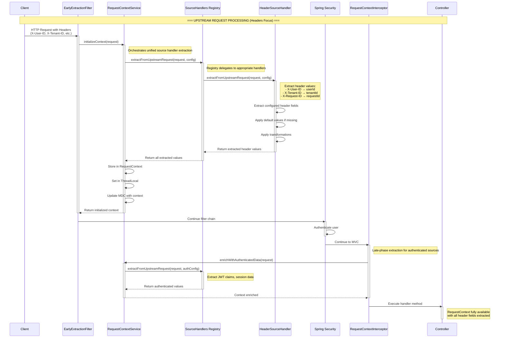
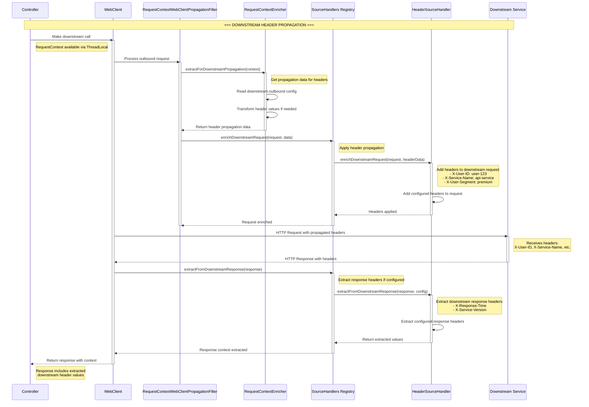

# Request Context Framework - Unified Source Handler Architecture

## Overview

The Request Context Framework uses a **Unified Source Handler** architecture that provides centralized context management with four-directional propagation (upstream/downstream, request/response). This document shows the complete flow focusing on header source type processing.

## Part 1: Upstream Request Processing Flow

This diagram shows the flow from client request through the unified source handler architecture, focusing on header extraction and enrichment.



## Part 2: Downstream Service Integration Flow

This diagram shows how the controller makes calls to downstream services using the unified source handler architecture for header propagation.



## Key Points About Unified Source Handler Architecture

### Unified Source Handler Pattern

1. **SourceHandlers Registry:**
    - Central registry for all source handlers (HEADER, COOKIE, QUERY, CLAIM, SESSION)
    - Auto-wiring and strategy pattern for handler selection
    - Consistent interface for all four operations

2. **HeaderSourceHandler Operations:**
    - `extractFromUpstreamRequest()`: Extract headers from incoming requests
    - `enrichUpstreamResponse()`: Add headers to outgoing responses
    - `enrichDownstreamRequest()`: Add headers to downstream service calls
    - `extractFromDownstreamResponse()`: Extract headers from downstream responses

3. **Four-Directional Propagation:**
    - **Upstream Request**: Extract X-User-ID, X-Tenant-ID from client
    - **Upstream Response**: Add response headers back to client
    - **Downstream Request**: Propagate X-Service-Name, X-User-Segment to services
    - **Downstream Response**: Extract X-Response-Time, X-Service-Version from services

4. **Configuration-Driven:**
    - Field configurations define which headers to extract/propagate
    - Default values and transformations applied automatically
    - Sensitive field masking and validation

## Summary: Unified Processing Flow

### **Phase 1: Upstream Header Processing**
```
HTTP Request (with headers) → EarlyExtractionFilter
    ↓
RequestContextService → SourceHandlers Registry → HeaderSourceHandler
    ↓
Extract headers (X-User-ID, X-Tenant-ID) → Store in RequestContext
    ↓
Spring Security → RequestContextInterceptor → Controller
```

### **Phase 2: Downstream Header Propagation**
```
Controller → WebClient → RequestContextWebClientPropagationFilter
    ↓
RequestContextEnricher → SourceHandlers Registry → HeaderSourceHandler
    ↓
Add headers (X-Service-Name, X-User-Segment) → Downstream Service
    ↓
Extract response headers (X-Response-Time) → Update RequestContext
```

## Benefits of Header-Focused Approach

### 🎯 **Simplified Understanding**
- **Header focus**: Shows the most common use case clearly
- **Reduced complexity**: Easier to follow without multiple source types
- **Clear patterns**: Four-directional header flow is easy to understand

### 📊 **Practical Examples**
- **Phase 1** shows header extraction from client requests (X-User-ID, X-Tenant-ID)
- **Phase 2** shows header propagation to downstream services (X-Service-Name, X-User-Segment)
- **Unified pattern** applies to all source types (COOKIE, QUERY, CLAIM, SESSION)

## How Components Use the Unified Source Handler

### HeaderSourceHandler Implementation
```java
@Component
public class HeaderSourceHandler implements SourceHandler {

    // Extract headers from incoming requests
    public <T> String extractFromUpstreamRequest(T request, InboundConfig config) {
        HttpServletRequest httpRequest = (HttpServletRequest) request;
        String headerName = config.getKey();
        String value = httpRequest.getHeader(headerName);

        // Apply default value if header missing
        return value != null ? value : config.getDefaultValue();
    }

    // Add headers to downstream requests
    public void enrichDownstreamRequest(ClientRequest.Builder requestBuilder,
                                       String key, String value, InboundConfig config) {
        requestBuilder.header(key, value);
        log.debug("Added header to downstream request: {}={}", key, value);
    }

    // Extract headers from downstream responses
    public String extractFromDownstreamResponse(ClientResponse response,
                                               OutboundConfig config) {
        String headerName = config.getKey();
        return response.headers().header(headerName).stream()
                .findFirst()
                .orElse(null);
    }
}
```

### SourceHandlers Registry Usage
```java
@Service
public class RequestContextService {

    private final SourceHandlers sourceHandlers;

    // Use registry to extract from all configured sources
    public void extractFromUpstreamRequest(HttpServletRequest request, RequestContext context) {
        properties.getFields().forEach((fieldName, fieldConfig) -> {
            if (fieldConfig.getUpstream() != null && fieldConfig.getUpstream().getInbound() != null) {
                // Delegate to appropriate handler via registry
                String value = sourceHandlers.extractFromUpstreamRequest(
                    request,
                    fieldConfig.getUpstream().getInbound()
                );

                if (value != null) {
                    context.put(fieldName, value);
                }
            }
        });
    }
}
```

## Complete Header Processing Flow Summary

### **Phase 1: Upstream Header Processing (Client → Controller)**

| Step | Component | Action | Headers Processed | Key Features |
|------|-----------|--------|------------------|--------------|
| 1 | **EarlyExtractionFilter → SourceHandlers → HeaderSourceHandler** | Extract headers | X-User-ID, X-Tenant-ID, X-Request-ID | **Early extraction before Spring Security** |
| 2 | **RequestContextInterceptor → SourceHandlers** | Enrich with auth headers | Authorization-derived headers | **Post-authentication enrichment** |
| 3 | **Controller** | Use context | All extracted header values available | **Complete header context access** |

### **Phase 2: Downstream Header Processing (Controller → Services)**

| Step | Component | Action | Headers Processed | Key Features |
|------|-----------|--------|------------------|--------------|
| 4 | **WebClient → RequestContextWebClientPropagationFilter → HeaderSourceHandler** | Propagate headers | X-Service-Name, X-User-Segment | **Downstream header propagation** |
| 5 | **HeaderSourceHandler** | Extract response headers | X-Response-Time, X-Service-Version | **Downstream response capture** |
| 6 | **RequestContext** | Update with response data | Response headers added to context | **Bidirectional header flow** |

## Key Architectural Improvements

### 🎯 **Unified Source Handler Design**
- **Single interface** for all source types (HEADER, COOKIE, QUERY, CLAIM, SESSION)
- **Four operations** per handler: upstream request/response, downstream request/response
- **Strategy pattern** with SourceHandlers registry for consistent access

### 🔄 **Four-Directional Header Flow**
- **Upstream Request**: Extract client headers (X-User-ID → userId)
- **Upstream Response**: Add response headers (userId → X-User-ID)
- **Downstream Request**: Propagate service headers (serviceHealth → X-Service-Name)
- **Downstream Response**: Capture response headers (X-Response-Time → downstreamResponseTime)

### 📊 **Configuration-Driven Processing**
- **Field configurations** define header mappings and transformations
- **Default values** applied when headers are missing
- **Sensitive field masking** for security compliance

### 🚀 **Consistent Pattern Across Source Types**
- **HeaderSourceHandler** for HTTP headers
- **CookieSourceHandler** for cookies (upstream-only)
- **QuerySourceHandler** for query parameters
- **ClaimSourceHandler** for JWT claims
- **SessionSourceHandler** for server-side session data

The unified source handler architecture provides a **consistent, extensible pattern** for handling all types of request context sources, with headers being the most commonly used example!