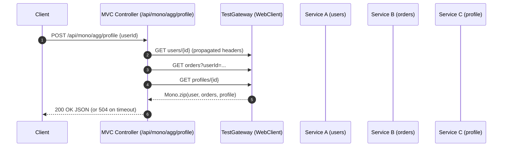

## Product Requirements: Mono-based Endpoints on a Servlet Container (Spring MVC)

### 1) Overview
- Purpose: Define requirements and guidance for building HTTP endpoints that return Reactor `Mono` while running on a traditional Servlet container (Spring MVC).
- Audience: Backend engineers, SRE/observability, QA.
- Scope: Endpoints that benefit from non-blocking semantics and reactive composition without migrating the app to WebFlux runtime.

### 2) Background: Mono on Spring MVC (Servlet)
- Spring MVC supports reactive return types (e.g., `Mono`) via ReactiveAdapter. Under the hood it bridges to Servlet async (similar to `DeferredResult`).
- You get reactive composition, cancellation signals, and operators, while keeping the Servlet stack.
- Important: returning `Mono` does not make a blocking downstream call non-blocking by itself. You must avoid blocking within reactive pipelines or offload via appropriate `Scheduler` (e.g., `boundedElastic`).

### 3) Goals
- Provide a consistent controller style that returns `Mono<ResponseEntity<...>>` on MVC.
- Preserve RequestContext + MDC across reactive chains and thread switches.
- Ensure robust timeout, cancellation, and error mapping through reactive operators.
- First-class observability: logs (JSON/MDC), metrics, traces, masked fields.
- Clear guidance for composition patterns (fan-out/join, retries, fallbacks).

### 4) Non-Goals
- Full migration to Spring WebFlux runtime (Netty). We remain on MVC + Servlet container.
- Streaming responses (prefer `SseEmitter`/`ResponseBodyEmitter` or WebFlux).

### 5) When to Use Mono on MVC
- You are composing multiple async/reactive WebClient calls.
- You need cancellation/timeout control with Reactor operators.
- You want to leverage Reactor operators for retries, backoff, and circuit-breaking.
- You need to free up the request thread while waiting for downstream calls.

### 6) Cross-Cutting Requirements
- Context propagation
  - RequestContext (user, tenant, requestId, etc.) + MDC must flow through reactive operators.
  - WebClient must receive propagated headers and produce masked logs.
- Timeouts & cancellation
  - Use `timeout(Duration)` with graceful mapping to 504.
  - Respect client disconnect (reactor cancellation) when possible.
- Errors
  - Map downstream errors to API error schema; always include `requestId`.
- Observability
  - Logs: structured JSON with masked sensitive fields.
  - Metrics: timers for endpoint duration; counters for timeouts/errors.
  - Traces: one server span; child spans for each WebClient call with masked tags.

### 7) Representative Endpoint Scenarios
1) Fan-out Aggregation (parallel WebClient calls, join with `Mono.zip`)
   - Behavior: Return when all complete or timeout. Optional partial-data policy.
   - SLA: P99 ≤ 2.5s; timeout 2.0s; soft budget 1.8s.

2) Slow/Variable Third-Party
   - Behavior: Compose reactive pipeline; apply `timeout`, `retryWhen` with jittered backoff.
   - SLA: P99 ≤ 3.0s; timeout 2.5s; max retries 1.

3) Async Write Acknowledgement (accept -> enqueue -> 202)
   - Behavior: Persist intent quickly; return `Mono.just(202)` while work continues elsewhere.
   - SLA: ≤ 150ms response.

4) Rate-Limited Windowed Calls
   - Behavior: Delay or backoff reactively until allowed; or fail fast with `429` + `Retry-After` guidance.

5) Bulk Orchestration with Bounded Parallelism
   - Behavior: Use `Flux.range(...).flatMap(..., concurrency)` with downstream `Mono` calls; collect to `Mono<List<...>>` and map to response.

### 8) API Contracts (Examples)
- Fan-out Aggregation (Mono)
  - POST /api/mono/agg/profile
  - Request: { userId: string }
  - 200 OK: { user: {...}, orders: [...], profile: {...], requestId, timing: {...} }
  - 504 Gateway Timeout: { error: "TIMEOUT", requestId }

- Async Write Ack (Mono)
  - POST /api/mono/jobs
  - 202 Accepted: { trackingId, requestId }

### 9) Error/Timeout Mapping
- Downstream 4xx → 424 (contextual) or pass-through 400/404 when appropriate
- Downstream 5xx → 502 Bad Gateway
- Reactive timeout → 504 Gateway Timeout
- Validation errors → 400 Bad Request
- Always include `requestId` in body and `X-Request-Id` header

### 10) Observability & Masking Requirements
- Logging
  - JSON logs with MDC; mask sensitive fields via MaskingHelper on retrieval for observability.
- Metrics
  - Timer per endpoint; counters for timeouts/errors/partials.
- Tracing
  - SpanTagBuilderHelper for endpoint and downstream spans; inherit RequestContext; mask sensitive tags.

### 11) Reference Implementation (Controller Skeleton on MVC)
Below shows a typical MVC controller method returning `Mono`. Replace types to fit your codebase (uses TestGateway + propagation already wired).

<augment_code_snippet mode="EXCERPT">
````java
@PostMapping("/api/mono/agg/profile")
public Mono<ResponseEntity<Map<String, Object>>> aggregate(@RequestBody Map<String, Object> req) {
    String userId = (String) req.get("userId");

    Mono<Map<String, Object>> user    = gateway.getEntity("users", userId);
    Mono<Map<String, Object>> orders  = gateway.listEntities("orders", Map.of("userId", userId));
    Mono<Map<String, Object>> profile = gateway.getEntity("profiles", userId);

    return Mono.zip(user, orders, profile)
        .timeout(Duration.ofMillis(1800))
        .map(t -> Map.of(
            "user", t.getT1(),
            "orders", t.getT2(),
            "profile", t.getT3(),
            "requestId", requestContext.get("requestId")
        ))
        .map(ResponseEntity::ok)
        .onErrorResume(TimeoutException.class, e -> Mono.just(
            ResponseEntity.status(HttpStatus.GATEWAY_TIMEOUT)
                .body(Map.of("error", "TIMEOUT", "requestId", requestContext.get("requestId")))
        ))
        .onErrorResume(ex -> Mono.just(
            ResponseEntity.status(HttpStatus.BAD_GATEWAY)
                .body(Map.of("error", "DOWNSTREAM", "message", ex.getMessage(),
                             "requestId", requestContext.get("requestId")))
        ));
}
````
</augment_code_snippet>

Notes
- Do not call `block()` in controller methods. Keep the pipeline non-blocking; any blocking work must be offloaded to `Schedulers.boundedElastic()`.
- Ensure RequestContext + MDC propagate into reactive operators (via our propagation helpers/hooks).
- WebClient filters already capture and propagate context headers and apply masking in logs.

### 12) Threading & Blocking Guidance
- Keep controller methods free of blocking I/O.
- If you must call blocking code, isolate with `publishOn(Schedulers.boundedElastic())` or wrap with `Mono.fromCallable(…)` on an elastic scheduler.
- Avoid over-using elastic pools; prefer native async APIs.

### 13) Sequence (Fan-out Aggregation with Mono)


### 14) Configuration & Infrastructure
- Spring MVC Async Support
  - Ensure `spring.mvc.async.request-timeout` (if used) ≥ endpoint timeout.
  - Configure MVC async executor if you have controller methods using `Callable` elsewhere.
- WebClient
  - Timeouts: connect/read must be < endpoint budget.
  - Propagation filters: enabled for logging and headers.
- Security
  - Early extraction still runs pre-security to set requestId; security context participates in propagation.

### 15) Acceptance Criteria (per endpoint)
- Happy path completes within SLA budgets.
- Timeout path returns 504 with error schema and `requestId`.
- Error path maps downstream failures to API error schema with `requestId`.
- Context propagation verified in logs, metrics, and traces (masked fields).
- API tests cover: all-success, one-failure, timeout, mixed latencies.

### 16) Test Plan (API-first)
- Fan-out Aggregation
  - Tests: all-success, one-failure (mapped), timeout, retry success, retry failure.
- Slow Third-Party
  - Tests: fast path, p95 latency, timeout, retry success, retry failure.
- Async Write Ack
  - Tests: 202 response within 150ms, job tracked via GET /api/jobs/{id}.
- Bulk Orchestration
  - Tests: N downstream calls with bounded concurrency; partial failures; join timeout.

### 17) Risks & Mitigations
- Risk: Hidden blocking in reactive chain ⇒ Mitigation: thread-dump analysis; BlockHound (optional) in tests.
- Risk: Context loss across threads ⇒ Mitigation: use provided context-propagation helpers/hooks.
- Risk: Timeout mismatch ⇒ Mitigation: align `timeout()` operator, WebClient timeouts, and MVC async timeout.

### 18) Future Work
- Optionally enable Reactor context propagation with a standardized `ContextView` across libraries.
- Add circuit breaker (Resilience4j) policies per endpoint.

