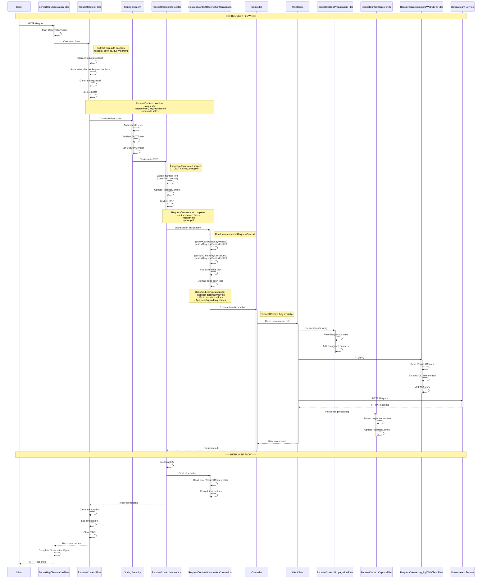

You're absolutely right! The `RequestContextObservationConvention` reads from the RequestContext that was already enriched by the Filter and Interceptor. Let me update the sequence diagram to show this correctly:


# Request Context Framework - Processing Flow

## Sequence Diagram



## Key Points About RequestContextObservationConvention

### The Convention READS from RequestContext (doesn't enrich it)

1. **RequestContextFilter enriches first:**
    - Creates RequestContext
    - Adds non-authenticated data
    - Sets requestId, path, method

2. **RequestContextInterceptor enriches second:**
    - Adds authenticated data (JWT claims)
    - Adds handler information
    - Adds principal

3. **RequestContextObservationConvention reads the enriched context:**
    - Reads fields from RequestContext
    - Applies field configurations (cardinality, sensitivity)
    - Adds as metrics tags
    - Adds as trace span tags

## Data Flow for Observability

```
HTTP Request
    ↓
ServerHttpObservationFilter (starts observation)
    ↓
RequestContextFilter (CREATE & ENRICH context)
    ↓
Spring Security (authenticate)
    ↓
RequestContextInterceptor (ENRICH with auth + handler)
    ↓
RequestContextObservationConvention (READ context → metrics/traces)
    ↓
Controller execution
```

## How RequestContextObservationConvention Uses the Context

```java
// The Convention reads from the already-enriched RequestContext
public KeyValues getLowCardinalityKeyValues(ServerRequestObservationContext context) {
    // Get the RequestContext that was enriched by Filter + Interceptor
    RequestContext requestContext = getRequestContext(context);
    
    // Read fields that were already extracted
    String userId = requestContext.get("userId");        // Added by Interceptor
    String tenantId = requestContext.get("tenantId");    // Added by Filter
    String handler = requestContext.get("handler");       // Added by Interceptor
    
    // Add as metrics tags based on field configuration
    return KeyValues.of(
        "user.id", userId,
        "tenant.id", tenantId,
        "handler", handler
    );
}
```

## The Complete Enrichment → Observation Flow

| Step | Component | Action | RequestContext State |
|------|-----------|--------|---------------------|
| 1 | Filter | Create & enrich | Has: requestId, headers, cookies |
| 2 | Interceptor | Enrich | Adds: JWT claims, handler, principal |
| 3 | **ObservationConvention** | **READ** | Uses complete context for metrics/traces |
| 4 | Controller | Use | Full context available |
| 5 | WebClient filters | Read & propagate | Uses context for downstream |

The key insight is that `RequestContextObservationConvention` is a **consumer** of the RequestContext, not a producer. It reads the fully-enriched context and transforms it into observability data!
```

This shows the correct relationship where the ObservationConvention reads from (not enriches) the RequestContext that was already populated by the Filter and Interceptor!