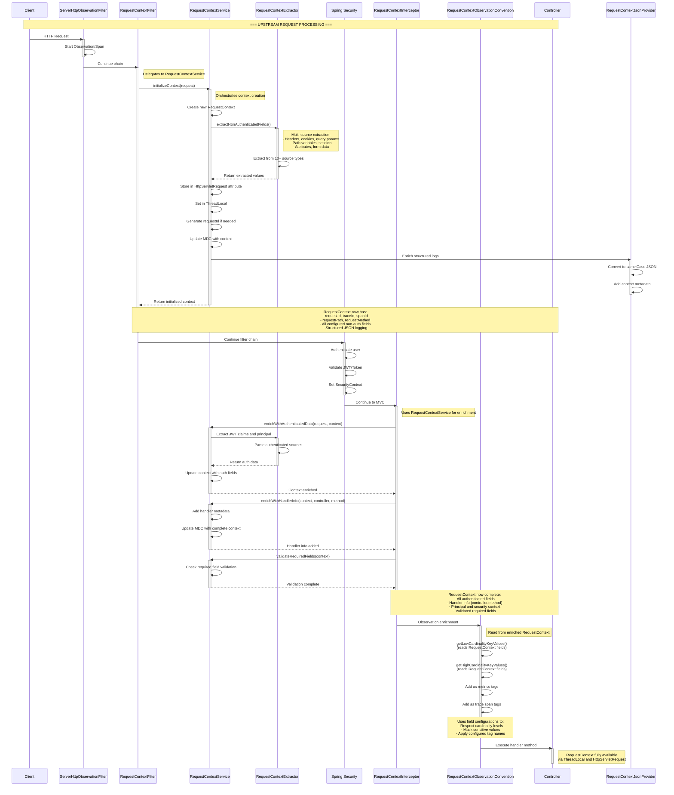
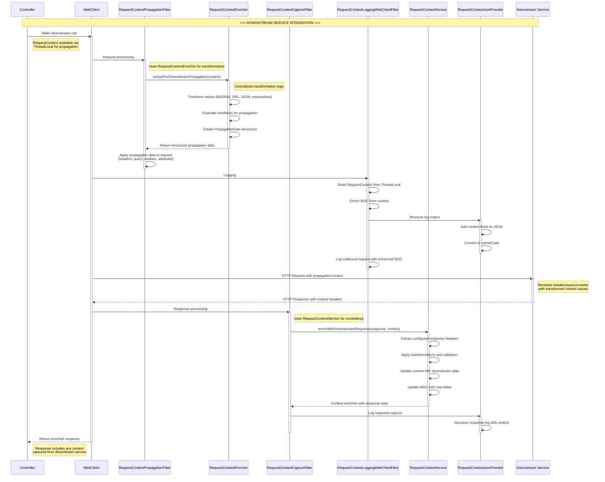

# Request Context Framework - Enhanced Processing Flow

## Overview

The Request Context Framework now uses a sophisticated **Service + Enricher** architecture that provides centralized context management, transformation capabilities, and structured JSON logging. This document shows the complete flow from request initiation through downstream service calls.

## Part 1: Upstream Request Processing Flow

This diagram shows the flow from client request through Spring Security to controller execution, highlighting how the RequestContext is built and enriched.



## Part 2: Downstream Service Integration Flow

This diagram shows how the controller makes calls to downstream services, with context propagation, transformation, and response capture.



## Key Points About Enhanced Architecture

### Service-Oriented Context Management

1. **RequestContextFilter delegates to RequestContextService:**
    - Service orchestrates context creation and initialization
    - RequestContextExtractor handles multi-source extraction (10+ source types)
    - Automatic MDC updates and structured JSON logging integration
    - ThreadLocal and HttpServletRequest attribute storage

2. **RequestContextInterceptor uses RequestContextService for enrichment:**
    - Service coordinates authenticated data extraction
    - Handler information capture and validation
    - Complete MDC updates with all context fields
    - Required field validation with detailed error reporting

3. **RequestContextEnricher provides centralized transformation:**
    - Value transformation (BASE64, URL encoding, JSON, expressions)
    - Expression evaluation with placeholder replacement
    - Condition evaluation for dynamic field propagation
    - Structured PropagationData for WebClient integration

4. **RequestContextObservationConvention reads the enriched context:**
    - Reads fields from fully-populated RequestContext
    - Applies field configurations (cardinality, sensitivity)
    - Adds as metrics tags and trace span tags
    - Respects masking for sensitive data in observability

## Summary: Two-Phase Processing Flow

### **Phase 1: Upstream Request Processing**
```
HTTP Request → ServerHttpObservationFilter → RequestContextFilter
    ↓
RequestContextService → RequestContextExtractor (multi-source extraction)
    ↓
Spring Security (authentication) → RequestContextInterceptor
    ↓
RequestContextService (auth enrichment) → RequestContextObservationConvention
    ↓
Controller (fully enriched context available)
```

### **Phase 2: Downstream Service Integration**
```
Controller → WebClient → RequestContextPropagationFilter
    ↓
RequestContextEnricher (transformation & propagation)
    ↓
Downstream Service Call → RequestContextCaptureFilter
    ↓
RequestContextService (response enrichment) → RequestContextJsonProvider
    ↓
Structured Logging & Response Return
```

## Benefits of Split Diagram Approach

### 🎯 **Improved Readability**
- **Focused scope**: Each diagram covers a specific phase of processing
- **Reduced complexity**: Easier to follow the flow without overwhelming detail
- **Clear separation**: Upstream vs downstream concerns are distinct

### 📊 **Better Understanding**
- **Phase 1** shows how the RequestContext is built and enriched before controller execution
- **Phase 2** shows how the enriched context is used for downstream service integration
- **Service orchestration** is clearly visible in both phases

## How Components Use the Enhanced RequestContext

### RequestContextService Orchestration
```java
// Service orchestrates context initialization
public RequestContext initializeContext(HttpServletRequest request) {
    RequestContext context = new RequestContext();

    // Delegate to extractor for multi-source extraction
    int fieldsExtracted = extractNonAuthenticatedFields(request, context);

    // Store in request attribute and ThreadLocal
    request.setAttribute(RequestContext.REQUEST_CONTEXT_ATTRIBUTE, context);
    RequestContext.setCurrentContext(context);

    // Update MDC for structured logging
    updateMDC(context);

    return context;
}
```

### RequestContextEnricher Transformation
```java
// Enricher provides centralized transformation logic
public Map<String, PropagationData> extractForDownstreamPropagation(RequestContext context) {
    Map<String, PropagationData> propagationData = new LinkedHashMap<>();

    properties.getFields().forEach((fieldName, fieldConfig) -> {
        if (shouldPropagateDownstream(fieldConfig)) {
            // Transform value based on configuration
            String value = transformValue(context.get(fieldName), outbound.getValueAs());

            // Evaluate condition for propagation
            if (evaluateCondition(outbound.getCondition(), context)) {
                propagationData.put(fieldName, new PropagationData(
                    outbound.getEnrichAs(),
                    outbound.getKey(),
                    value,
                    isSensitive(fieldConfig)
                ));
            }
        }
    });

    return propagationData;
}
```

### RequestContextObservationConvention Reading
```java
// Convention reads from the fully-enriched RequestContext
public KeyValues getLowCardinalityKeyValues(ServerRequestObservationContext context) {
    // Get the RequestContext enriched by Service + Extractor + Enricher
    RequestContext requestContext = getRequestContext(context);

    // Read fields that were extracted and transformed
    String userId = requestContext.get("userId");        // Added by Service via Interceptor
    String tenantId = requestContext.get("tenantId");    // Added by Service via Filter
    String handler = requestContext.get("handler");       // Added by Service via Interceptor

    // Add as metrics tags based on field configuration
    return KeyValues.of(
        "user.id", userId,
        "tenant.id", tenantId,
        "handler", handler
    );
}
```

## Complete Processing Flow Summary

### **Phase 1: Upstream Processing (Client → Controller)**

| Step | Component | Action | RequestContext State | Key Features |
|------|-----------|--------|---------------------|--------------|
| 1 | **Filter → Service → Extractor** | Create & enrich | Has: requestId, headers, cookies, query params, path variables, session, attributes | **Multi-source extraction (10+ types)** |
| 2 | **Interceptor → Service** | Enrich with auth | Adds: JWT claims, handler, principal, validation | **Service orchestration, validation** |
| 3 | **ObservationConvention** | **READ** | Uses complete context for metrics/traces | **Enhanced field configuration** |
| 4 | **Controller** | Use | Full context available via ThreadLocal/attribute | **Comprehensive context access** |

### **Phase 2: Downstream Processing (Controller → Services)**

| Step | Component | Action | RequestContext State | Key Features |
|------|-----------|--------|---------------------|--------------|
| 5 | **WebClient → Enricher** | Transform & propagate | Uses enricher for value transformation | **Centralized transformation logic** |
| 6 | **WebClient → Service** | Capture response | Enriches context from downstream responses | **Downstream response integration** |
| 7 | **JsonProvider** | Structure logs | Converts context to structured JSON | **Enhanced JSON logging** |

## Key Architectural Improvements

### 🎯 **Service-Oriented Design**
- **RequestContextService** orchestrates all context operations
- Clear separation of concerns between extraction, enrichment, and transformation
- Centralized validation, MDC management, and error handling

### 🔄 **RequestContextEnricher Integration**
- Centralized transformation logic (BASE64, URL encoding, JSON, expressions)
- Condition evaluation for dynamic field propagation
- Reusable across WebClient filters and other components

### 📊 **Enhanced JSON Logging**
- **RequestContextJsonProvider** for structured log output
- camelCase field conversion for JSON consistency
- Integration with LoggingEventCompositeJsonEncoder

### 🚀 **Multi-Source Extraction**
- Support for 10+ source types (headers, JWT, cookies, query, path, session, attributes, form, body)
- Configurable extraction strategies per field
- Error handling and fallback mechanisms

The key insight remains: `RequestContextObservationConvention` is a **consumer** of the RequestContext, but now it reads from a much more sophisticated context that has been enriched through a service-oriented architecture with centralized transformation capabilities!